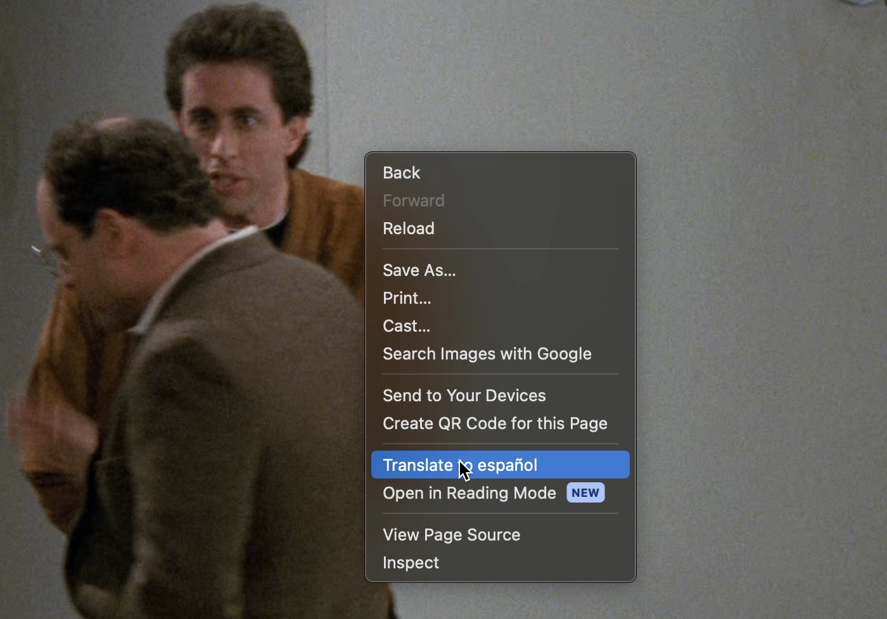
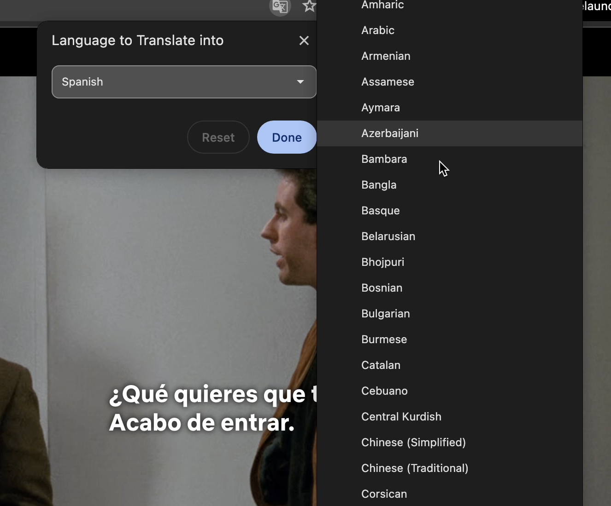
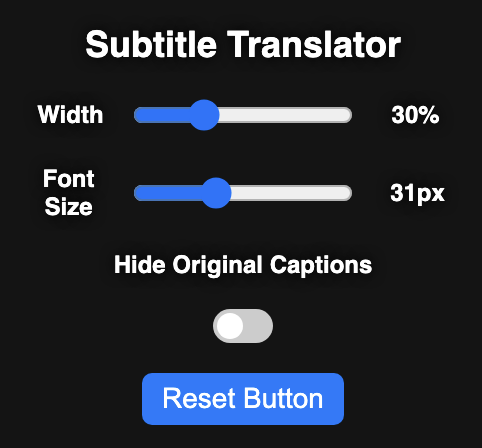

#  Netflix Dual Subtitle Chrome Extension

## Motivation
I'm learning Spanish and thought that it would be a great idea to have two subtitles, one in Spanish and one in English would be useful while watching shows in Spanish.
Sometimes Netflix would not offer Spanish as an option for English shows, and this would be able to bypass that.

## Setting up
1. Go to **chrome://extensions/**
2. Click on "Load Unpacked" in the top left, and select this folder
3. Once complete, this app is available in your extensions.

## How to use
1. Go to Netflix.com
2. Right click and press translate. Choose your target language.&nbsp;&nbsp;&nbsp;&nbsp;
   
   

4. Translated Subtitles in your target language should appear.

## Functionalities 

1. The translated text box can be dragged around the screen.
2. Font size and textbox width can be adjusted using the slider bar in the extension's popup.
3. Toggle off/on the original captions using the "Hide Original Captions" button.
4. To reset all settings, click on "Reset"

## Prerequisites
Chrome
